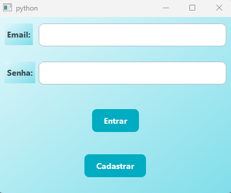
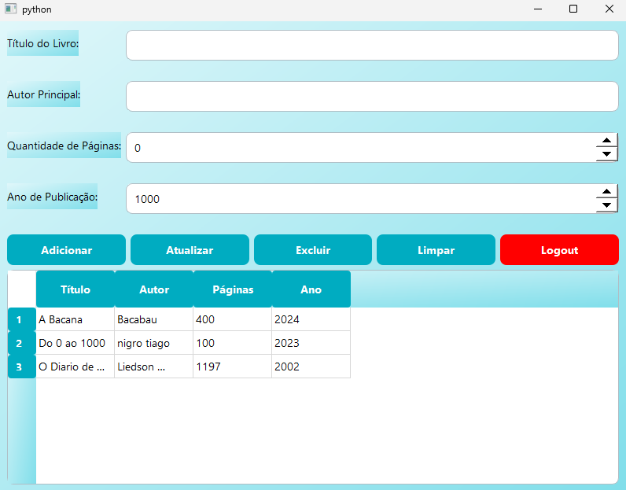

# 📚 Gerenciamento de Livros - PyQt5 + Firebase

Este é um sistema de gerenciamento de livros desenvolvido em **Python**, utilizando **PyQt5** para a interface gráfica e **Firebase Firestore** para armazenamento dos dados.

## 📥 Instalação

### 🔧 Requisitos
Certifique-se de ter instalado:
- Python 3.8+
- Pip (gerenciador de pacotes do Python)

### 📌 Passos para instalação
1. **Clone o repositório**
   ```sh
   git clone https://github.com/seu-usuario/seu-repositorio.git
   cd seu-repositorio
   ```

2. **Crie um ambiente virtual (opcional, mas recomendado)**
   ```sh
   python -m venv venv
   source venv/bin/activate  # Linux/Mac
   venv\Scripts\activate  # Windows
   ```

3. **Instale as dependências**
   ```sh
   pip install -r requirements.txt
   ```

4. **Configuração do Firebase**
   - No Firebase Console, crie um projeto e ative o **Firestore Database**.
   - Baixe o arquivo `firebase_config.json` e coloque na raiz do projeto.
   - Adicione `firebase_config.json` ao `.gitignore` para evitar compartilhamento de credenciais.

5. **Execute o sistema**
   ```sh
   python main.py
   ```

## 🚀 Funcionalidades
- 📚 **Adicionar, atualizar e excluir livros**
- 🔍 **Listagem de livros em uma tabela**
- 🔑 **Autenticação via Firebase**
- 🚪 **Logout do sistema**

## 🎮 Como usar
1. **Faça login** ou cadastre-se.
2. **Adicione um novo livro** preenchendo os campos e clicando em "Adicionar".
3. **Atualize um livro** selecionando-o na tabela, editando os dados e clicando em "Atualizar".
4. **Exclua um livro** clicando nele e depois no botão "Excluir".
5. **Saia do sistema** clicando em "Logout".

## 🖼️ Prints da Interface





## 🏗️ Estrutura do Código
```
livro_cadastro/
│-- main.py              # Arquivo principal
│-- tela_login.py        # Tela de login
│-- tela_adm.py          # Tela principal
│-- firebase_config.py   # Configuração do Firebase
│-- requirements.txt     # Dependências do projeto
│-- firebase_config.json # Credenciais do Firebase (não deve ser compartilhado)
│-- LICENSE              # Licença do projeto
│-- README.md            # Documentação
│-- .gitignore           # Arquivos ignorados pelo Git

## 🛠️ Tecnologias Utilizadas
- **Python 3**
- **PyQt5** (interface gráfica)
- **Firebase Firestore** (banco de dados)

## 📄 Licença
Este projeto está sob a licença MIT. Veja o arquivo **LICENSE** para mais detalhes.
